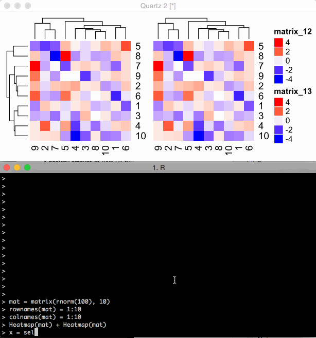

<!--
%\VignetteEngine{knitr}
%\VignetteIndexEntry{7. Interactive with Heatmaps}
-->

Interactive with Heatmaps
========================================

**Author**: Zuguang Gu ( z.gu@dkfz.de )

**Date**: `r Sys.Date()`

-------------------------------------------------------------

```{r global_settings, echo = FALSE, message = FALSE}
library(markdown)

library(knitr)
knitr::opts_chunk$set(
    error = FALSE,
    tidy  = FALSE,
    message = FALSE,
    fig.align = "center",
    fig.width = 5,
    fig.height = 5)
options(markdown.HTML.stylesheet = "custom.css")

options(width = 100)
```

If the heatmap is plotted in the interactive graphic device, users can use mouse
to select a sub-area in the heatmap and retrieve index for rows and columns in that selected area.
Since heatmaps are always used to visualize patterns that are clustered together, 
this feature can greatly give convinience to extract the sub-matrix that users are interested in.

<p></p>
